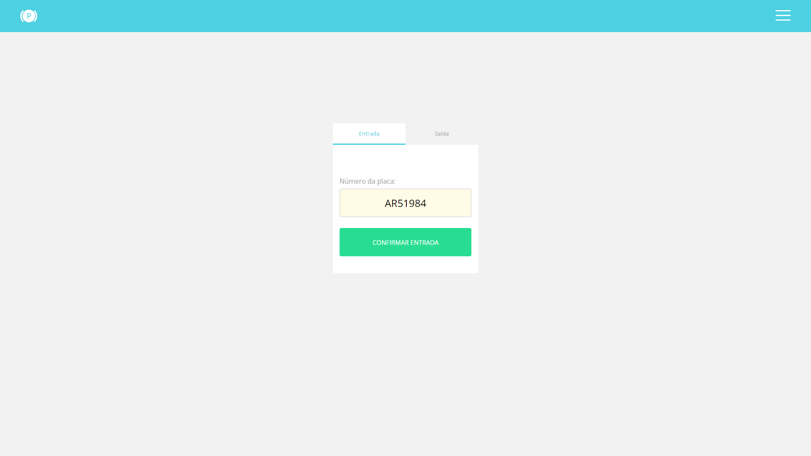
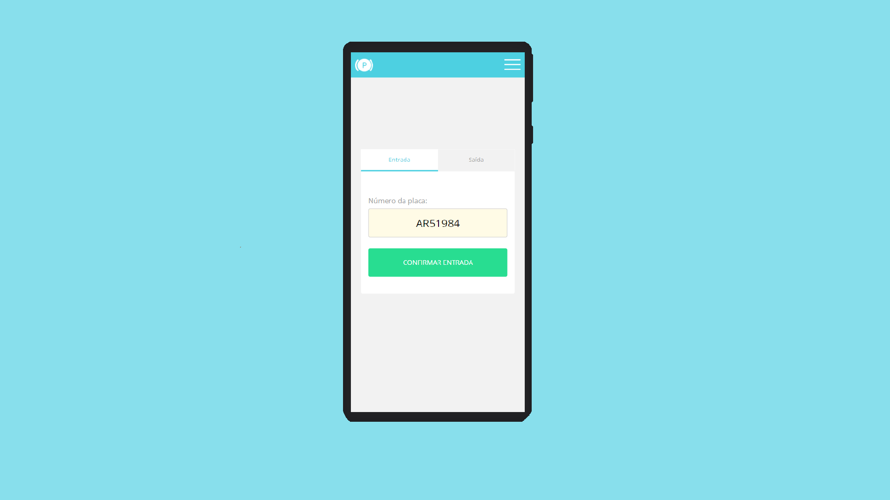

#Parking-App

### Sobre o Parking-App

O projeto 'Parking-App' é uma aplcaiação de controle de estacionamento. Tem por objetivo, prover uma interface que se conecte com um servidor para obter informações dos veículos estacionados. Também torna possível informar ao servidor dados relacionados a determinado veículo, por exemplo:
 
Se o mesmo se encontra no estacionamento;
 
Se já efetuou pagamento;
 
Se já saiu do estacionamento;
 
 

> Interface do Parking-App funcionando em uma tela de alta escala.

> Interface do Parking-App funcionando em um dispositivo móvel.

### Click at link below to see it working! / Clique no link abaixo para vê-lo funcionando!

<a href="https://yurimayk.github.io/parking/">Clique aqui!</a>

### Etapas do Projeto

Este projeto ainda está em fase de desenvolvimento. Abaixo estão as tarefas executadas, e as tarefas previstas para finalizá-lo:

- [x] Criação do Projeto React;
- [x] Instalação de dependências básicas;
- [x] Criação de pasta assets;
- [x] Adição de arquivos visuais planejados para o projeto, na pasta assets;
- [x] Criação de Containers, com o objetivo de separar as principais seções do aplicativo;
- [x] Criação de componentes, com o objetivo de reutilização de código;
- [x] Armazenamento de estilos globais à parte;
- [x] Estilos responsivos;
- [x] Utilização de funções assíncronas para realizar requisições à API;
- [x] Requisição HTTP, utilizando Method POST para enviar: {Veículo estacionado/Pagamento realizado/Saída Liberada};
- [ ] Requisição HTTP, utilizando Method GET, para obter histórico de veículos;
- [x] Renderizadas as requisições HTTP;
- [x] Retorno visual de erros;
- [ ] Renderização de seção de confirmação;
- [ ] Criação de menu lateral;
- [ ] Criação de Rotas para menu lateral;
- [ ] Criação de função de retenção de Veículo em caso de Pagamento não realizado;
- [ ] Exibição de histórico de cada placa;
- [x] Aprimorar responsividade;
- [ ] Testes (jest);
- [x] Realização de Deploy;
- [x] Dispor projeto online.

 
 

### <a href="https://parking-lot-to-pfz.herokuapp.com/parking">API UTILIZADA</a>

 

# Dados da API:

 

## Rota para cadastrar estacionamento de um veículo por placa

 

Endpoint: https://parking-lot-to-pfz.herokuapp.com/parking 
Method: POST 
Informação enviada no Headers:{ 
Content-type: Application/json 
} 
informação à ser enviada: { 
"plate":"XXX-9999" 
} 
 
- Observação: A informação a ser enviada pelo Header, não é necessário se o usurário utilizar o cliente HTTP AXIOS. 
- Observação²: A informação a ser enviada, precisa ir exatamente conforme o modelo. Qualquer desvio de caracter a API retornará um erro, possIvelmente BAD REQUEST 400. Por exemplo: 
 
<ul>
<li>'plate' DEVERÁ está entre aspas.</li>
  
<li>Os dígitos da placa além de estar entre aspas, precisam estar em maíusculo, afim de evitar ambiguidades por parte da API(XXX é considerado diferente de xxx, ou seja, a placa 'XXX-9999' seria considerada diferente da placa 'xxx-9999'.)</li>
 
<li>Os três primeiros Caracteres da placa, <strong>DEVERÃO ESTAR SEPARADOS</strong> dos últimos quatro dígitos, por meio de um hífen.</li>
</ul>
 
 

## Rota para confirmar pagamento pelo uso do estacionamento
 
Endpoint: https://parking-lot-to-pfz.herokuapp.com/parking/aAa-4444/pay 
Method: POST 
 
Observação³: Esta rota é bastante simples, mas precisa ser configurada corretamente. Para isso é necessário que, seguindo o mesmo padrão da rota anterior, os caracteres da placa sejam colocados em UPPERCASE, e haja separação, por meio de hífen, entre os três primeiros digitos e os últimos. Nesta rota, a placa <strong>não deverá</strong> estar entre aspas.  
Observação4: O valor utilizado como Endpoint deverá ser alterado. onde encontra-se 'aAa-4444' deverá encontrar-se os 8 caracteres da placa(incluindo o hífen).  

## Rota para liberar a saída do veículo
 

Endpoint: https://parking-lot-to-pfz.herokuapp.com/parking/AaA-4444/out 
Method: POST 
 
Observação5: Assim como a rota responsável pelo pagamento, esta rota é bastante simples, mas também requer a mesma atenção ao configurar requisição para API. É necessário que, seguindo o mesmo padrão da rota anterior, os caracteres da placa sejam colocados em UPPERCASE, e haja separação, por meio de hífen, entre os três primeiros digitos e os últimos. A placa <strong>não deverá</strong> estar entre aspas. 
Observação6: O valor utilizado como Endpoint deverá ser alterado. onde encontra-se 'AaA-4444' deverá encontrar-se os 8 caracteres da placa(incluindo o hífen). 
  

## Rota para acessar o histórico por placa
 
Endpoint: https://parking-lot-to-pfz.herokuapp.com/parking/AaA-4444 
Method: GET 
 
Observação7: O valor utilizado como Endpoint deverá ser alterado. onde encontra-se 'AaA-4444' deverá encontrar-se os 8 caracteres da placa(incluindo o hífen). 
Observação8: A configuração desta rota, não difere em sua requisição. No entanto, Ela será dotada de uma resposta em formato JSON, conforme demonstrado abaixo: 
 
Response: { 
[ 
{ 
"time": "1 days 3 hours", 
"paid": true, 
"left": true, 
"plate": "YUR-1996", 
"reservation": "6241fc" 
}, 
{ 
"time": "42 seconds", 
"paid": true, 
"left": true, 
"plate": "YUR-1996", 
"reservation": "624382" 
} 
] 
} 
  

## Legenda referente ao JSON
 

> No array acima, há inditificação de DUAS ENTRADAS no estacionamento pela placa YUR-1996. Cada "objeto" dentro deste array, é uma entrada do veículo.
> A ordem cronológica é do mais antigo para o mais atual.
>
> > time: informação do tempo que o veículo passou estacionado. A informação aparecerá entre aspas e conterá datações em inglês(days=dias; hours=horas; minutes=minutos;seconds=segundos.).
> > paid: informação a respeito do pagamento. Se false, pagamento não confirmado. Se true, pagamento confirmado.
> > left: informação sobre a ausência do veículo. Se o veículo tiver saido constará o valor true, se ainda estiver dentro do estacionamento, constará o valor false.
> > plate: placa do carro, entre aspas.
> > reservation: código de controle de cada entrada no estacionamento. Ao entrar no estacionamento é gerado este código e armazenado no servidor.
   

### O que é necessário para rodar e/ou realizar deploy neste projeto?
 
<table>

<tr>
    <td>axios:</td>
    <td>^0.26.1</td>
    <td>Necessário para rodar o projeto.</td>
</tr>
<tr>
    <td>gh-pages</td>
    <td>^3.2.3</td>
    <td>Necessário para realizar deploy</td>
</tr><tr>
    <td>react</td>
    <td>^17.0.2</td>
    <td>Necessário para rodar o projeto</td>
</tr><tr>
    <td>react-scripts</td>
    <td>5.0.0</td>
    <td>Necessário para rodar o projeto</td>
</tr><tr>
    <td>styled-components</td>
    <td>^5.3.5</td>
    <td>Necessário para estilização do projeto</td>
</tr><tr>
    <td>web-vitals</td>
    <td>^2.1.4</td>
    <td>Necessário para rodar o projeto.</td>
</tr>

</table>
  

> > > Ao lonar este repositório, é necessário instalar as dependências. Para isso é necessário reconstruir a pasta node-modules, utilizando npm install( ou yarn add).
   

### Quais scripts usar para rodar a aplicação pelo terminal?
 

Este projeto foi iniciado com create-react-app(segue código abaixo).

> <<<<<<< $ npx create-react-app parking >>>>>>>
 
Observação: O npx é um executor de pacotes NPM, ou seja, para usar o npx é necessário que ele esteja instalado no dispositivo. Para isso, basta usar o comando npm (abaixo):

> <<<<<<< npm install -g npx >>>>>>>
 

Para mais informações sobre o create react app acesse o link a seguir: [Create React App](https://github.com/facebook/create-react-app).
   

## Iniciando o projeto
 
Segue abaixo os scripts utilizados nesse projeto:
  

### `npm start`
 

(alternativa yarn: `yarn start`)
  

O npm start roda a aplicação no modo desenvolvimento. Após executá-lo, será possível acessar o projeto no link a seguir, em seu navegador.
[http://localhost:3000](http://localhost:3000)
  

A página irá recarregar, ou renderizar, quando mudanças forem salvas nos arquivos renderizáveis. Cada vez que uma mudança for realizada, será possível que retorne informações no window.console.
 
 

### `npm test`
 

(alternativa yarn: `yarn test`)
  

Executa o observador de teste em um modo interativo. Por padrão, executa testes relacionados a arquivos alterados desde o último commit. Para mais informações acessar o link a seguir: [running tests](https://facebook.github.io/create-react-app/docs/running-tests)
  

### `npm run build`
 
 

(alternativa yarn: `yarn build`)
 

Compila o aplicativo para produção na build(pasta de compilação). Ele agrupa corretamente o React no modo de produção e otimiza a compilação para o melhor desempenho. A compilação é minificada e os nomes dos arquivos incluem os hashes.
após esse comando o aplicativo estará pronto para o deploy.
  

Para mais informações sobre deploy, acesse o link a seguir: [deployment](https://facebook.github.io/create-react-app/docs/deployment).
  

### `npm run eject`
 

**OBSERVAÇÃO: Este é um comando sem volta. Uma vez tendo executado-o não há possibilidades de retorno.**
 

Se você preferir ejetar a build inserida na produção, basta executar esse comando.
Ele não destruirá as configurações. Mas copiará para o projeto. E para realizar deploy o script build deverá ser executado novamente.
  

## Dificuldades
  

Este projeto iniciou-se no dia 23 de março de 2022. 
Havia a possibilidade de utilizar O JavaScript puro e, a utilização preferível do React, uma bilioteca JavaScript. Também seria possível o uso de outra bilioteca.  

O desenvolvedor optou pelo uso da Biblioteca React, da qual possuia pouco conhecimento. 
Houveram duas grandes dificuldades: A primeira referente ao uso geral do React Hook useRef para que componentes pudessem herdar propriedades. E a segunda referente ao consumo da API.  

Em relação à primeira, durante todo o projeto, houve dificuldades em referênciar componentes e repassar informações. Após várias pesquisas e tentativas de utilização de referências associadas mais facilmente ao Javascript puro. Utilizando o `React.create.ref()` e o `React.fowardRef()` foi possível conntinuar com o React.
  

Referente à segunda grande dificuldade: 
Em decorrência de conhecimentos previos de NodeJs, o consumo de API não foi uma dificuldade maior. Houve dificuldade em assimilar as informações em formato curl, recebidas. Ao tentar utilizar o cliente HTTP AXIOS, o único método conhecido pelo desenvolvedor, houve desencontro de informações, tanto pela requisição à API, quanto na recepção de resposta provinda pela mesma. Por não estar familiarizado com a sintaxe JSON, parâmetros foram enviados com sintaxe não adequada, gerando assim um grande contratempo e investimento em pesquisas sobre o formato do comando curl, sobre clientes HTTP, sobre o uso do fetch no React, e sobre erros HTTP que eram retornados pela API.  
A título de exemplo: 'Error 400 - Bad Request'e 'Error 422 - Unprocessable Entity'. Felizmente depois de muita pesquisa, decidiu-se usar uma ferramenta cliente de API REST chamada Insomnia, com base nos dados retornados por ela, fora possivel assimilar os padrões de resposta da API. Ao todo, foram quatro dias de longo estudo/pesquisas/aplicação/observação. 
  

## 💻 Desenvolvedor:🪑
O criador e desenvolvedor deste projeto:

<table>
  <tr>
    <td align="center">
      <a href="#">
         
        
          <a href="https://www.linkedin.com/in/yurimayk/" target="_blank"><b>Yuri Medeiros</b></a>
        
      </a>
    </td>
</table>

[⬆ Voltar ao topo](#nome-do-projeto) 

### Palavras finais

**Desenvolvedor**: Foi um prazer poder participar deste desafio proposto pela Parafuzo. Posso afirmar que devido ao meu pouco conhecimento com a bilioteca React. Este acabou sendo um desafio muito maior do que o que estive habituado. Como perceptível a aplicação não fora finalizada. Espero que a documentação, possa de alguma forma ser proveitosa para outros desenvolvedores. Pretendo desenvolver o Parking-App até o limite de planejamento. E se possível desenvolvê-lo além disso.

<strong> Atenciosamente,</strong>
<i>Yuri Mayk Medeiros</i>